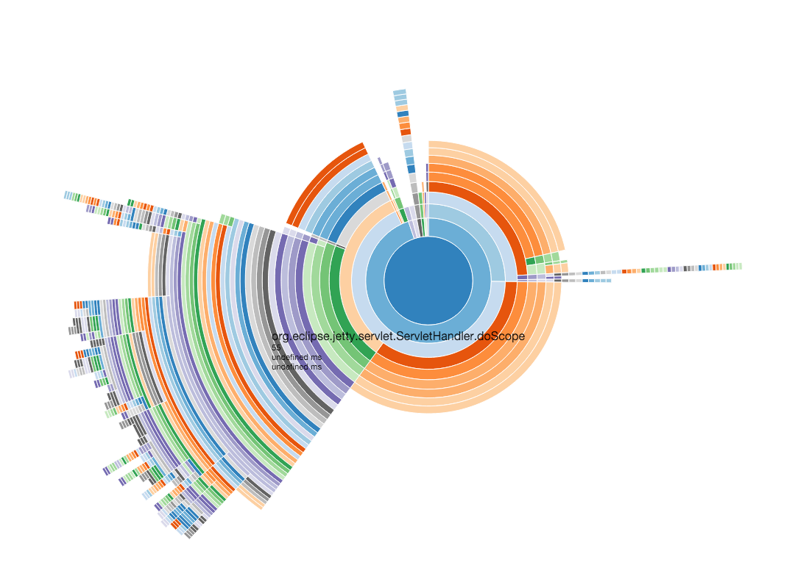

# STARDUST

Stardust is hack consisting of a [D3 sunburst visualization](http://bl.ocks.org/mbostock/4348373) and a little dirty parser for Java thread dumps. 

## How to use

Everything is contained in the `index.html` file so you just load that on a webserver and view the page in your browser - Chrome is preferred. You can also try it out at [TODO](http://url-goes-here). 

Once the page is loaded find one or more thread dumps - generated via `jstack <pid> > threads.log` - and drag the files onto page. No files will be uploaded as the parsing and rendering happens on the page itself.
